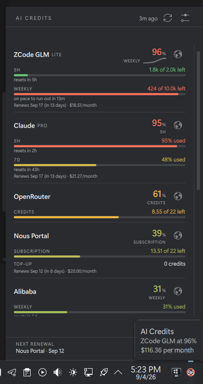

# AI Credits

A Plasma 6 system-tray applet showing remaining quota, credits and renewal costs
across eight AI providers, on Fedora / KDE / Wayland.

Two decoupled pieces joined by one JSON file:

- **`daemon/aicredits`** — a Python collector run by a systemd user timer. It
  writes `~/.local/state/aicredits/state.json` and keeps history in
  `~/.local/share/aicredits/history.db`.
- **`plasmoid/org.kde.plasma.aicredits`** — a QML applet that only ever reads
  that file. It makes no network calls, so the panel can never block on a slow
  vendor API.



## Where the numbers come from

| Provider | Source | Freshness |
|---|---|---|
| Codex | live `codex app-server` → `account/rateLimits/read` (5h + weekly); falls back to the latest session rollout | live / cached |
| SuperGrok | briefly starts the authenticated `grok` client in a private terminal to refresh `billing: fetched credits config`; falls back to the latest unified log record | live / cached |
| ZCode GLM | live `GET api.z.ai/api/monitor/usage/quota/limit` (5h + weekly credit windows), key via `aicredits auth set zai`; falls back to `~/.zcode/v2/logs/*.log` | live |
| Nous Portal | live `GET /api/oauth/account` + `/api/billing/state`, token from `~/.hermes/auth.json` | live |
| Claude | live OAuth usage via Claude Code's local login (5h + 7d); falls back to Claude Code's cached usage, then transcript spend | live / cached |
| Alibaba | `bl usage token-plan --output json` (official CLI, needs `bl auth login --console`); falls back to `~/.qwen/usage_record.jsonl` consumption | live / last `qwen` run |
| OpenRouter | live `GET /api/v1/credits` — needs a stored **management** key | live |
| Antigravity | `agy --print "/usage" --output-format text` (Gemini + Claude/GPT groups, weekly + 5h) | live |

Several of these are private, undocumented endpoints or log formats that can
change without notice. Adapters fail soft: a provider that cannot be read keeps
showing its last good figures marked `stale`, and never silently reads as 0%.

**Why some providers are read from disk:** ZCode stores its token with Electron
`safeStorage` (`enc:v1:…`, keyed by the OS keyring), so it is reached with a
Z.ai API key you supply. Current native Claude Code releases expose their OAuth
login in `~/.claude/.credentials.json`; the collector reads the access token in
place (it never copies or logs it) to request the real subscription windows.
Codex and SuperGrok need no separately stored credential. The collector reuses
each installed client's existing login and does not send a prompt or start a
model turn. Codex exposes its current rate limits through App Server. Grok
refreshes its billing configuration during client startup, so the collector
starts it under a private pseudo-terminal and closes it as soon as that record
arrives. If either client is unavailable, its last cached figures remain visible
and age normally in the UI.

**Percentages are normalised on the way in.** Providers disagree about what a
percentage means, and each disagreement is a bug waiting to happen:

| Provider | Reports | Stored as |
|---|---|---|
| Antigravity | percent **remaining** | inverted to used |
| Alibaba | a **ratio** (`0.31`) in a field named `Percentage` | ×100 |
| Z.ai | `usage` = the limit, `currentValue` = consumed | computed from the pair |
| Codex, Grok | percent used | as-is |

Timestamps are equally mixed: Alibaba and Z.ai send milliseconds, Antigravity
sends ISO 8601, Codex sends epoch seconds.

## Install

```bash
cp systemd/aicredits.{service,timer} ~/.config/systemd/user/
systemctl --user daemon-reload && systemctl --user enable --now aicredits.timer
kpackagetool6 --type Plasma/Applet --install plasmoid/org.kde.plasma.aicredits
```

Then right-click the panel → *Add Widgets* → **AI Credits**.

## Use

```bash
bin/aicredits poll --force      # refresh everything now
bin/aicredits status            # same data in the terminal
bin/aicredits doctor            # what each adapter can and cannot see
```

Store a credential (libsecret → KWallet; nothing sensitive is written to disk).
Run it with no value and paste at the prompt — input is hidden, so the key stays
out of your shell history and terminal scrollback:

```bash
bin/aicredits auth set openrouter
bin/aicredits auth set zai
bin/aicredits auth list
```

Record what a subscription costs, so the popup footer can total it:

Right-click the widget, choose **Configure AI Credits**, and use the
**Subscriptions** page. OpenRouter is intentionally omitted because its credit
balance is prepaid. Supported billing cadences include daily, weekly, monthly,
quarterly, and annual. The same values can be managed from the terminal:

```bash
bin/aicredits config set providers.claude.renewal.date 2026-09-20
bin/aicredits config set providers.claude.renewal.cost_usd 100
bin/aicredits config set providers.claude.renewal.cadence monthly
```

Alibaba Token Plan quota needs a console login for Alibaba's own CLI — the
plan's `sk-sp-` key is a *model* key and is not accepted for quota queries:

```bash
bl auth login --console
```

The console's web gateway is deliberately not scraped: it sits behind an
anti-automation layer, so scripting it would mean defeating a bot check.

Thresholds and poll intervals:

```bash
bin/aicredits config get general
bin/aicredits config set general.warn_pct 90        # amber
bin/aicredits config set general.critical_pct 95    # red + notification
bin/aicredits config set providers.claude.interval 900
```

## Working on the plasmoid

```bash
kpackagetool6 --type Plasma/Applet --upgrade plasmoid/org.kde.plasma.aicredits
systemctl --user restart plasma-plasmashell.service     # required to reload QML
journalctl --user -u plasma-plasmashell.service -f | grep -i aicredits
```

`qmllint -I /usr/lib64/qt6/qml <file>.qml` catches syntax and layout errors
before install. `plasma-sdk` (not installed) would provide `plasmoidviewer` for
a faster loop.

### QML gotchas this applet hit

Each of these failed **silently** — no error, just wrong output:

- **Custom properties read through a typed `PlasmoidItem` return `undefined`
  inside a delegate.** Under `pragma ComponentBehavior: Bound` the lookup is
  resolved against the C++ type. Reach shared state through the untyped `owner`
  property instead. This cost an indent (`x: undefined` → 0) and nearly cost
  more.
- **`Layout.fillWidth` on an item that can be invisible fills nothing.** The
  plan chip is absent for some providers, which un-anchored the whole figure
  column on exactly those rows. Use an explicit spacer `Item`.
- **`Layout.preferredHeight` alone does not size the popup**; it needs
  `Layout.maximumHeight` too.
- **A `ScrollView` assigned as `contentItem` loops** when its delegates derive
  width from the view (QTBUG-83890). Anchor it and pin the horizontal scrollbar
  off instead.
- **`opacity` multiplies into children** — put alpha in the colour when only the
  parent should be faded.
- **XMLHttpRequest cannot read `file://`** unless plasmashell is started with
  `QML_XHR_ALLOW_FILE_READ=1`. This applet uses a `Plasma5Support.DataSource`
  executable engine running `cat` instead. Do not "fix" this back to XHR.

## Test

```bash
python3 -m unittest discover -s tests
```

42 tests, no dependencies. Parsers run against redacted copies of real CLI
output in `tests/fixtures/`, so they work offline; each provider's quirks
(remaining-vs-used, ratio-vs-percent, ms-vs-seconds) are pinned by a test.

## Status

All eight providers report live when their authenticated clients, APIs, or
credentials are available. Every adapter retains its last good result and marks
it stale if a refresh fails. Subscription renewal dates and costs are optional
and editable from the widget's configuration window. Subscription quota meters
calculate cycle-aware burn-rate pacing and time-to-exhaustion estimates.

### Automatic recovery

The timer checks for due work every two minutes. Healthy providers retain their
configured intervals; failed, stale, and reset windows retry after two minutes.
Cached readings remain marked stale until recovery succeeds.

Claude automatically renews expired local OAuth credentials by starting the
installed client in safe mode with empty print input, then retries the usage API.
This sends no model prompt and leaves credential rotation to Claude Code.
Nous uses the installed Hermes token resolver, including its credential locks;
set `providers.nous.hermes_dir` for a nonstandard Hermes installation.
Codex, Grok, Alibaba, and Antigravity already query their installed clients on
scheduled polls; OpenRouter and Z.ai query their APIs directly.

Network outages are retried automatically. Revoked logins, missing credentials,
and vendor changes that break a client's interface can still require repair;
the collector preserves the last reading without presenting it as current.
